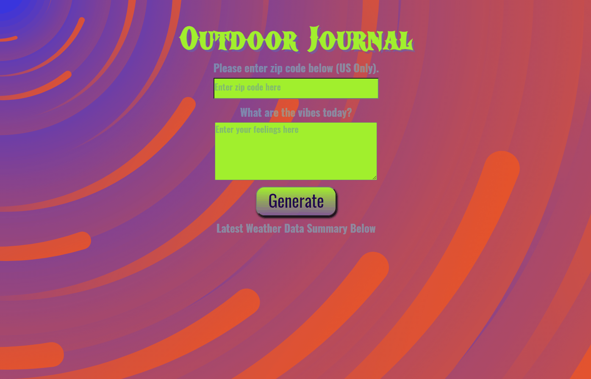

# Outdoor Journal ⛈️☀️🌬️


</br>
The herein repository host the necessary assets for a Weather-Journal Application called "Outdoor Journal." It consists of an asynchronous web application that uses Web API and user data to update its user-interface.

## Table of Content

1. [Design](#Design)
2. [Instructions](#Instructions)
   1. [Download repository files](#Download-repository-files)
   2. [Setup environment](#Setup-environment)
   3. [Add modules to setup server](#Add-module-to-setup-server)
   4. [Add more modules to setup server](#Add-more-modules-to-setup-server)
   5. [Modify script in 'package.json'](#Modify-script-in-'package.json')
   6. [Add cors middleware](#Add-cors-middleware)
   7. [Add module to use fetch API in Node](#Add-module-to-use-fetch-API-in-Node)
   8. [Add NeDB module](#Add-NeDB-module)
   9. [Add the OpenWeatherMap Api key](#Add-the-OpenWeatherMap-Api-key)
   10. [Run the server](#Run-the-server)
3. [Examples](#Examples)
   1. [Example of hovering page](#Example-of-hovering-page)
   2. [Example of input data and seeing UI update](#Example-of-input-data-and-seeing-UI-update)
   3. [Example of error-handling](#Example-of-error-handling)
4. [Tools](#Tools)
5. [License](#License)

## Design

The herein project consists of an asynchronous application using HTML, CSS, and Vanilla JavaScript for the front-end as well as Node.js, Express.js and again Vanilla JavaScript for the back end. Also, the database module used to store data locally is a lightweight JS version of MongoDB, namely NeDB. The project displays a single page, where a user can input in a ‘input’ box and ‘textarea’ to add their zip code and a short text on how they feel, respectively. The data received on the client-side is processed on the server-side; where it fetches weather data from an api (OpenWeather). Once the api request is received on the server-side, it is processed and sent in JSON format to the client side to update the user interface with a ‘summary output’. All successful outputs are saved locally in a database file called ‘weatherdatabase.db’. The background of the page was produced by Matt Visiwig from SVG Backgrounds.

## Instructions

### Download repository files

To have access to the assets necessary for the project, you may download the 'zip file' directly from the herein repository. Otherwise, you can clone the repository by using Git (<https://github.com/aimogue/Weather-Journal-Application.git>), Github CLI (gh repo clone aimogue/Weather-Journal-Application) or Github Desktop. For more information on to clone a repository, please use the following link: <https://docs.github.com/en/free-pro-team@latest/github/using-git/which-remote-url-should-i-use>.

### Setup environment

Once the assets are within a folder, the environment needs to be setup. To do-so, it would be worthwhile using Git commands. It is pre-installed on Mac OS and Linux Distros, but not on Windows. For more information on how to setup Git on PC, please use the following link: <https://www.computerhope.com/issues/ch001927.htm>. To use the herein project, it will be necessary to have both Node.js and npm. To download them, please use the following link: <https://www.npmjs.com/get-np>.
</br></br>

To check if Node.js is installed, run the following command in the terminal:

```bash
node -v
```

To confirm that npm is installed, run this command in the terminal:

```bash
npm -v
```

To initialize the project, use the following command:

```bash
npm init
```

### Add modules to setup server

Use the following line, to add Node.js, and Express.js.

```bash
npm i node express
```

### Add more modules to setup server

Use the following line, to add 'dotenv', and 'nodemon'.

```bash
npm i --save-dev dotenv nodemon
```

### Modify script in 'package.json'

Remove 'test' script inside the 'scripts class and the following:

```json
"devStart": "nodemon server.js"
```

### Add cors middleware

Use the following line, to add cors and morgan.

```bash
npm i cors morgan
```

### Add module to use fetch API in Node

Use the following line, to add node-fetch.

```bash
npm i node-fetch --save
```

### Add NeDB module

Use the following command to add the NeDB module:

```bash
npm i nedb
```

### Add the OpenWeatherMap Api key

Create an empty 'dotenv' file. Then, you need to fetch your api key. Go to <https://openweathermap.org/ap>, find the 'Current Weather Data' collection and subscribe to the free-tier. Then, retrieve the api key and place it in your 'dotenv' file.

### Run the server

Use the following command to launch the project:

```bash
npm run devStart
```

## Examples

### Example of hovering page


### Example of input data and seeing UI update


### Example of error-handling



## Tools

This webpage uses the following technologies for the front-end: HTML, CSS, and JavaScript (Vanilla). It also uses JavaScript on the server-side with Node.js and Express.js. The weater data is extracted via an api from <https://openweathermap.org/>.

## License

This codebase is a public domain, so feel free to use this repo for what you want.
